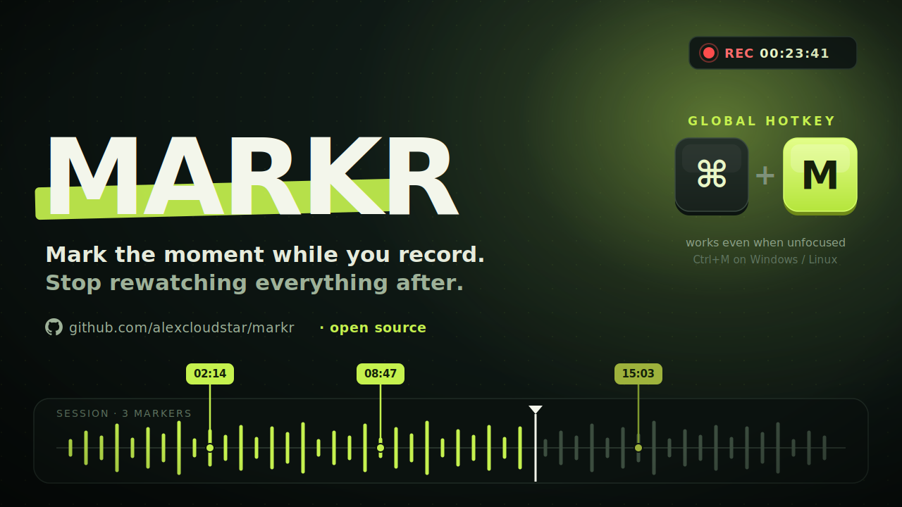

<p align="center">
  
</p>

# Markr

A minimal desktop timer for marking timestamps during a live session. Start a session, drop markers with a button or a global hotkey (works even when Markr is in the background), and review them in order. Everything lives in memory: no saving, no database, no accounts.

## Download

Grab the installer for your OS from the [latest release](https://github.com/alexcloudstar/markr/releases/latest):

| OS      | File                            |
| ------- | ------------------------------- |
| macOS   | `Markr-x.y.z-arm64.dmg` or `.zip` |
| Windows | `Markr.Setup.x.y.z.exe`         |
| Linux   | `.AppImage` or `.deb`           |

The builds are unsigned, so the first launch needs one extra step:

- **macOS**: right-click `Markr.app`, choose **Open**, then confirm. Or System Settings → Privacy & Security → **Open Anyway**.
- **Windows**: on the SmartScreen prompt, click **More info**, then **Run anyway**.

After that first launch it opens normally.

## Usage

- **Start Session** sets `t = 0` and starts the timer.
- **Mark** logs the current elapsed time as `mm:ss`.
- Global hotkey: **Cmd+M** (macOS) / **Ctrl+M** (Windows, Linux) does the same as Mark, even when the app is not focused. It is only active while a session is running.
- **Stop Session** freezes the timer and keeps the markers visible.
- Starting a new session resets the timer and clears the markers.

## Stack

- Electron + React (TypeScript), bundled with electron-vite
- Tailwind CSS v4
- shadcn/ui components
- Global hotkey via Electron `globalShortcut`

## Development

```bash
bun install
bun dev          # launch in development
bun run build    # production build into out/
bun run typecheck
```

## Packaging

```bash
bun run dist        # installers for the current OS, into release/
bun run dist:mac    # macOS only
bun run dist:win    # Windows only
bun run dist:linux  # Linux only
```

Pushing a `v*` tag (for example `v0.1.0`) runs the GitHub Actions release workflow, which builds installers on macOS, Windows, and Linux and uploads them all to a single GitHub Release.
